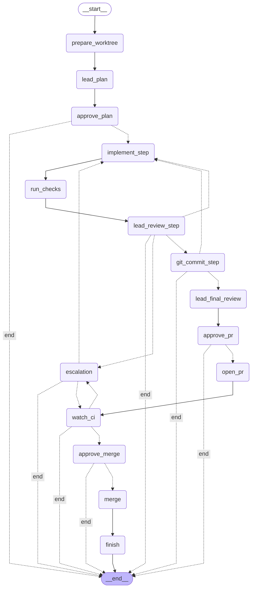

# Orchestrator graph

The Mermaid diagram below is the 12a ticket-run topology; the node-by-node
behaviour is specified in `ARCHITECTURE.md` §4.

```mermaid
---
config:
  flowchart:
    curve: linear
---
graph TD;
	__start__([<p>__start__</p>]):::first
	prepare_worktree(prepare_worktree)
	lead_plan(lead_plan)
	approve_plan(approve_plan)
	implement_step(implement_step)
	run_checks(run_checks)
	lead_review_step(lead_review_step)
	git_commit_step(git_commit_step)
	lead_final_review(lead_final_review)
	approve_pr(approve_pr)
	open_pr(open_pr)
	watch_ci(watch_ci)
	approve_merge(approve_merge)
	merge(merge)
	escalation(escalation)
	finish(finish)
	__end__([<p>__end__</p>]):::last
	__start__ --> prepare_worktree;
	approve_merge -. &nbsp;end&nbsp; .-> __end__;
	approve_merge -.-> merge;
	approve_plan -. &nbsp;end&nbsp; .-> __end__;
	approve_plan -.-> implement_step;
	approve_pr -. &nbsp;end&nbsp; .-> __end__;
	approve_pr -.-> open_pr;
	escalation -. &nbsp;end&nbsp; .-> __end__;
	escalation -.-> implement_step;
	escalation -.-> watch_ci;
	git_commit_step -. &nbsp;end&nbsp; .-> __end__;
	git_commit_step -.-> implement_step;
	git_commit_step -.-> lead_final_review;
	implement_step --> run_checks;
	lead_final_review --> approve_pr;
	lead_plan --> approve_plan;
	lead_review_step -. &nbsp;end&nbsp; .-> __end__;
	lead_review_step -.-> escalation;
	lead_review_step -.-> git_commit_step;
	lead_review_step -.-> implement_step;
	merge --> finish;
	open_pr --> watch_ci;
	prepare_worktree --> lead_plan;
	run_checks --> lead_review_step;
	watch_ci -. &nbsp;end&nbsp; .-> __end__;
	watch_ci -.-> approve_merge;
	watch_ci -.-> escalation;
	finish --> __end__;
	classDef default fill:#f2f0ff,line-height:1.2
	classDef first fill-opacity:0
	classDef last fill:#bfb6fc

```
